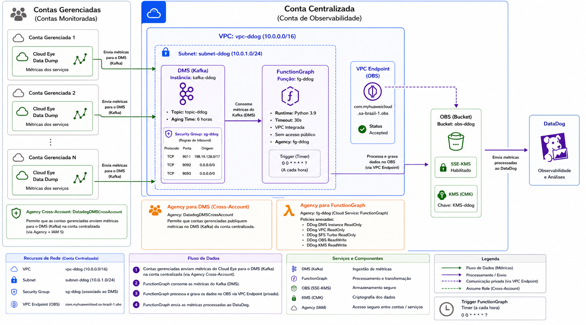

# Integração entre Cloud Eye e Datadog

Processo construído para integração customizada entre o serviço **Cloud Eye** da **Huawei Cloud** e o **Datadog**. 

---

## Solução Macro

A solução utiliza uma arquitetura com dois tipos de conta:

### Contas Gerenciadas

Responsáveis por **produzir** as métricas de monitoração:

1. **Export**: Utilizam a feature **Data Dump** do serviço **Cloud Eye** para enviar métricas ao **DMS** da Conta Centralizada.

   > ⚠️ Caso a feature **Data Dump** não esteja disponível, entre em contato com o suporte Huawei Cloud.

### Conta Centralizada

Responsável por **consolidar e adaptar** as métricas recebidas:

1. **Consolidação**: Uma instância **DMS** (Kafka) recebe as métricas de todas as Contas Gerenciadas.

2. **Adaptação e envio**: Uma **FunctionGraph** executa o adapter customizado que:
   - Consome métricas do DMS
   - Transforma para o formato Datadog
   - Envia as métricas transformadas ao Datadog

---

## Diagrama de Arquitetura

Diagrama da solução considerando todos os recursos e o fluxo de funcionamento.

---

> 📋 Detalhes técnicos, como configuração de consumo, envio, persistência, contrato do handler, dependências e testes, estão documentados no documento `SETUP.md`.