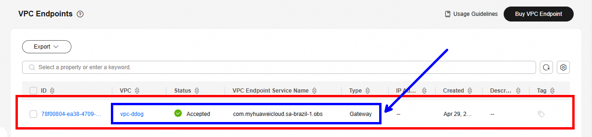
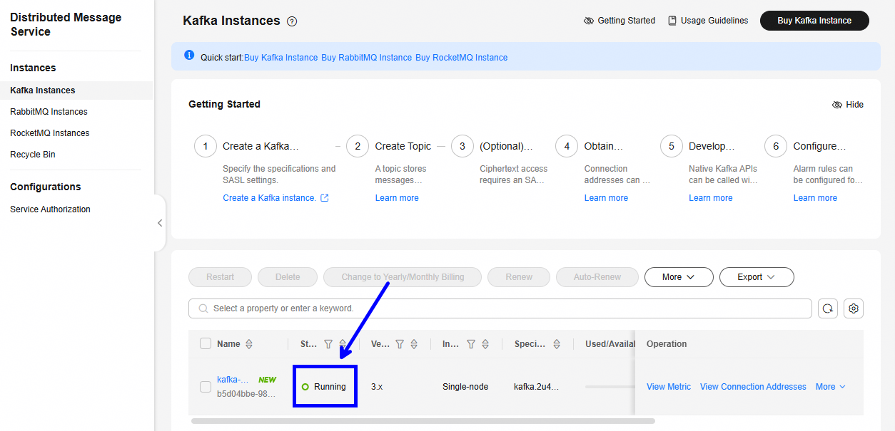
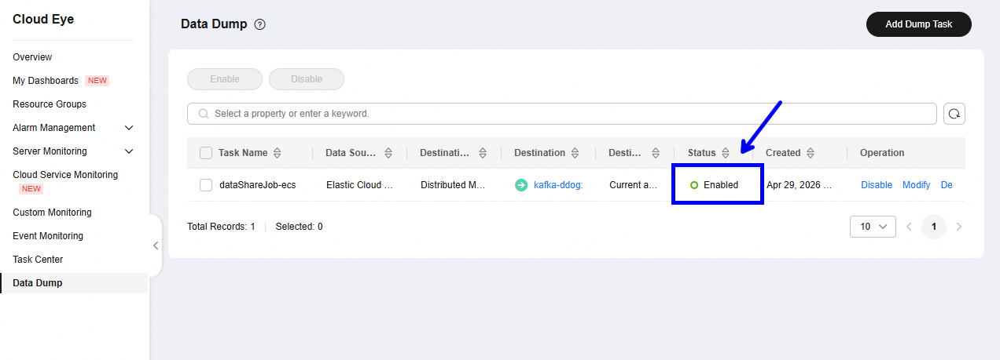
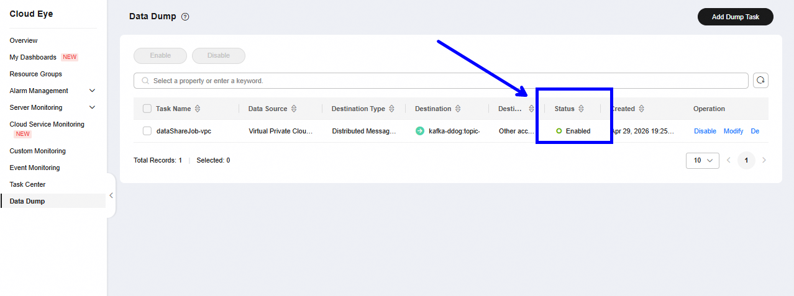

# Setup

Instructions for setting up the integration of **Cloud Eye** with **Datadog**.

> 💡 All values presented are **suggestions for validation/experimentation**. Adapt according to your architecture patterns.

This document guides the configuration of a distributed architecture with two types of accounts:

- **Centralized Account**: Hosts the central infrastructure (VPC, Kafka/DMS, FunctionGraph, OBS, KMS)
- **Managed Accounts**: Originate data through Data Dump that flows to Kafka in the Centralized Account

# Table of Contents

- [Part I: Centralized Account](#part-i-centralized-account)
- [Part II: Managed Accounts](#part-ii-managed-accounts)
- [Appendix](#appendix)
  - [Execution Flowchart](#execution-flowchart)
  - [Next Steps after Setup](#next-steps-after-setup)
  - [Technical Details](#technical-details)
  - [Integration Tests](#integration-tests)
  - [Dependencies](#dependencies)
  - [Troubleshooting](#troubleshooting)

# **Part I**: Centralized Account

## Prerequisites

Before you begin, you will need:
- Access to the Centralized Account with permissions to create resources
- Account ID of the Centralized Account
- Account IDs of all Managed Accounts that will send data
- Datadog credentials (API Key and endpoint URL)

## **Step 1**: VPC (Virtual Private Cloud)

Select the **VPC** service, click on **Create VPC** and enter the configuration values.

**Parameters:**
- VPC Name: `vpc-ddog`
- VPC IPv4 CIDR Block: `10.0.0.0/16`
- Subnet Name: `subnet-ddog`
- Subnet IPv4 CIDR Block: `10.0.1.0/24`

## **Step 2**: VPC Endpoint

In the **VPC** service select the **VPC Endpoints** menu, click on **Buy VPC Endpoint** and configure:

**Parameters:**
- Service List: `com.myhuaweicloud.{region}.obs`
- VPC: `vpc-ddog`
- Route Table: `rtb-vpc-ddog`

> Expected status: **Accepted** (see example image)




## **Step 3**: Security Group

In the **VPC** service, access the **Security Groups** menu, click on **Create Security Group** and configure:

**Parameters:**
- Name: `sg-ddog`
- Inbound Rules:

  | Protocol | Port | Source          |
  |----------|------|-----------------|
  | TCP      | 9011 | 198.19.128.0/17 |
  | TCP      | 9092 | 0.0.0.0/0       |
  | TCP      | 9093 | 0.0.0.0/0       |

## **Step 4**: DMS (Distributed Message Service)

### Create DMS

In the **DMS** service, click on **Buy Kafka Instance** and configure:

**Parameters:**
- Billing Mode: `Pay-per-use`
- Architecture: `Single-node`
- Broker Flavor: `kafka.2u4g.single.small`
- Disk Type: `High I/O`
- VPC: `vpc-ddog`
- Subnet: `subnet-ddog`
- Security Group: `sg-ddog`
- Instance Name: `kafka-ddog`

> Expected status: **Running** (see example image)



---

### Create Topic

In the created DMS instance, access the **Topic Management** menu, click on **Create Topic** and configure:

**Parameters:**
- Topic Name: `topic-ddog`
- Partitions: `1`
- Aging Time (h): `6`

## **Step 5**: KMS (Key Management Service)

In the **Data Encryption Workshop** service, access the **Key Management Service** menu, click on **Create Key** and configure:

**Parameter:**
- Name: `kms-ddog`


## **Step 6**: OBS (Object Storage Service)

In the **OBS** service, click on **Create Bucket** and configure:

**Parameters:**
- Bucket Name: `obs-ddog` or another available name
- Block Public Access: `Enabled seetings: 4`
- Bucket Policy: `Private`
- Server-Side Encryption: `Enabled`
- Encryption Method: `SSE-KMS`
- Encryption Key Type: `Custom`
- Custom: `kms-ddog`

## **Step 7**: IAM Policies and Agency for FunctionGraph

### Create Custom Policies

In the **IAM** service, access the **Permissions > Policies/Roles** menu and click on **Create Custom Policy** for each policy below:

#### 1. Policy: DMS (Read-only)

**Name:** `policy-ddog-dms-readonly`

```json
{
    "Version": "1.1",
    "Statement": [
        {
            "Effect": "Allow",
            "Action": [
                "dms:instance:get",
                "dms:instance:list"
            ]
        }
    ]
}
```

#### 2. Policy: VPC (Read-only)

**Name:** `policy-ddog-vpc-readonly`

```json
{
    "Version": "1.1",
    "Statement": [
        {
            "Effect": "Allow",
            "Action": [
                "vpc:ports:get",
                "vpc:ports:create",
                "vpc:vpcs:get",
                "vpc:subnets:get"
            ]
        }
    ]
}
```

#### 3. Policy: OBS (Read-Write)

**Name:** `policy-ddog-obs-readwrite`

```json
{
    "Version": "1.1",
    "Statement": [
        {
            "Effect": "Allow",
            "Action": [
                "obs:object:GetObject",
                "obs:bucket:HeadBucket",
                "obs:object:PutObject",
                "obs:bucket:ListBucket"
            ],
            "Resource": [
                "OBS:*:*:object:obs-ddog/*",
                "OBS:*:*:bucket:obs-ddog"
            ]
        }
    ]
}
```

#### 4. Policy: KMS (Read-Write)

**Name:** `policy-ddog-kms-readwrite`
**Policy:** (replace `{KMS_KEY_ID_CENTRALIZED_ACCOUNT}` with the KMS ID of the Centralized Account):

```json
{
    "Version": "1.1",
    "Statement": [
        {
            "Effect": "Allow",
            "Action": [
                "kms:cmk:get",
                "kms:dek:create",
                "kms:dek:decrypt"
            ],
            "Resource": [
                "KMS:*:*:KeyId:{KMS_KEY_ID_CENTRALIZED_ACCOUNT}"
            ]
        }
    ]
}
```

---

### Create Agency for FunctionGraph

In the **IAM** service, access the **Agencies** menu and click on **Create Agency**:

**Parameters:**
- Agency Name: `agency-ddog-fg`
- Agency Type: `Cloud Service`
- Cloud Service: `FunctionGraph`

**Authorize for the following policies:**
- `policy-ddog-dms-readonly`
- `policy-ddog-vpc-readonly`
- `policy-ddog-obs-readwrite`
- `policy-ddog-kms-readwrite`

## **Step 8**: Cloud Eye Data Dump (Centralized Account)

> 💡 Adds Data Dump for the **ECS** service. Include other **Dumps** for other services that need to be monitored in the Centralized Account.

In the **Cloud Eye** service, access the **Data Dump** menu and click on **Add Dump Task**:

**Parameters:**
- Name: `dataShareJob-ecs`
- Resource Type: `Elastic Cloud Server`

> Expected status: **Enabled** (see example image)



## **Step 9**: Agency for DMS (Cross-Account Access)

> 💡 This Agency allows Managed Accounts to send data to the Kafka of the Centralized Account. Configure **IAM 5** via URL: `https://console-intl.huaweicloud.com/iam5`

---

### Create Policy in IAM 5

In the **IAM 5** service, access the **Identity Policies** menu and click on **Create Identity Policy**:

**Name:** `policy-ddog-dms-readonly-iam5`

**Trust Policy** (replace `{DMS_ID}` with the DMS ID):

```json
{
  "Version": "5.0",
  "Statement": [
    {
      "Effect": "Allow",
      "Action": [
        "dms:instance:getDetail",
        "dms:topic:get",
        "dms:topic:list"
      ],
      "Resource": [
        "dms:*:*:kafka:{DMS_ID}",
        "dms:*:*:topic:*"
      ]
    },
    {
      "Effect": "Allow",
      "Action": [
        "dms:instance:list"
      ]
    }
  ]
}
```

---

### Create Trust Agency

In the **IAM** service, access the **Agencies** menu and click on **Create Trust Agency**:

**Parameters:**
- Agency Name: `agency-ddog-dms`
- Agency Type: `Custom trust policy`

**Trust Policy:** Replace `{ACCOUNT_ID_CENTRALIZED}` with the Account ID of the Centralized Account.

```json
{
  "Version": "5.0",
  "Statement": [
    {
      "Action": [
        "sts:agencies:assume"
      ],
      "Effect": "Allow",
      "Principal": {
        "IAM": [
          "{ACCOUNT_ID_CENTRALIZED}"
        ]
      }
    }
  ]
}
```

**Authorize the Agency** for the policy `policy-ddog-dms-readonly-iam5`.

**Edit the Trust Policy** to add the Account IDs of each Managed Account. Replace `{ACCOUNT_ID_MANAGED_1}`, `{ACCOUNT_ID_MANAGED_2}` and `{ACCOUNT_ID_MANAGED_N}` with the Account IDs of the Managed Accounts):

```json
{
  "Version": "5.0",
  "Statement": [
    {
      "Action": [
        "sts:agencies:assume"
      ],
      "Effect": "Allow",
      "Principal": {
        "IAM": [
          "{ACCOUNT_ID_CENTRALIZED}",
          "{ACCOUNT_ID_MANAGED_1}",
          "{ACCOUNT_ID_MANAGED_2}",
          "{ACCOUNT_ID_MANAGED_N}"
        ]
      }
    }
  ]
}
```

## **Step 10**: FunctionGraph

In the **FunctionGraph** service, click on **Create Function** and configure:

**Parameters:**
- Function Type: `Event Function`
- Function Name: `fg-ddog`
- Agency: `agency-ddog-fg`
- Runtime: `Python 3.9`
- Public Access: `Disabled`
- VPC Access: `Enabled`
- VPC: `vpc-ddog`
- Subnet: `subnet-ddog`

## **Step 11**: Configure FunctionGraph

In the **Configuration** menu of the FunctionGraph, adjust:

### Basic Settings

- Execution Timeout (s): `30`

---

### Environment Variables

| Variable                               | Example Value                                | Description                       |
|----------------------------------------|----------------------------------------------|-----------------------------------|
| `KAFKA_BOOTSTRAP`                      | `<KAFKA_BROKER_IP>:9092`                    | Kafka cluster address             |
| `KAFKA_TOPIC`                          | `topic-ddog`                                 | Kafka topic name                  |
| `OBS_BUCKET`                           | `obs-ddog`                                   | OBS bucket                        |
| `OBS_ENDPOINT`                         | `https://obs.{region}.myhuaweicloud.com`     | OBS endpoint                      |
| `OBS_PREVIOUS_LAST_PROCESSED_OFFSET`   | `offset-control.json`                        | Offset control file               |
| `MAX_MESSAGES`                         | `500`                                        | Message limit per execution       |
| `DATADOG_API_URL`                      | `https://api.datadoghq.com/api/v2/series`   | DataDog API endpoint              |
| `DATADOG_API_KEY`                      | `<YOUR_DATADOG_API_KEY>`                    | Datadog API Key                   |

## **Step 12**: Deploy FunctionGraph

The deployment consists of 3 stages: create the Kafka dependency, add the dependency to the function, and upload the code.

---

### Create Kafka Dependency

Prepare the dependency file:

```bash
# Navigate to the project root
cd /path/to/fg-kafka-to-ddog

# Compress the kafka folder
zip -r kafka.zip kafka/
```

In the **FunctionGraph** service, access the **Dependencies** menu and click on **Create Dependency**:

**Parameters:**
- Name: `kafka`
- Runtime: `Python 3.9`
- File: upload the `kafka.zip` file generated above

---

### Add Dependency to Function

In the `fg-ddog` function created in Step 10, at the bottom of the page, find the **Dependencies** section and click on **Add Dependency**.

Select the `kafka` dependency created in Stage 1.

---

### Upload Function Code

Copy the code from the [index.py](index.py) file and add it to the function project:

1. In the **FunctionGraph** service, open the `fg-ddog` function
2. In the code editor, replace the existing content with the code from [index.py](index.py)
3. Click on **Deploy** or **Save and Deploy**

## **Step 13**: Validate FunctionGraph Execution

Before configuring the automatic trigger, validate that the function can execute correctly.

### Run Function

In the **FunctionGraph** service, open the `fg-ddog` function and click on **Test Function** or **Run**:

**Expected validation:**
- ✅ Execution with **Success** status
- ✅ Logs showing successful Kafka connection
- ✅ Data consumed from the topic (or "empty queue" if no messages available)
- ✅ Successful upload to OBS (if data exists)
- ✅ JSON response with `statusCode: 200 or 202`

## **Step 14**: Configure Trigger (Scheduling)

After validating that the function executes correctly, configure the automatic trigger in the **Configuration** menu of the FunctionGraph:

**Parameters:**
- Trigger Type: `Time`
- Timer Name: `timer-ddog`
- Rule: `Cron expression`
- Value: `*/1 * * * * ?`

| Expression | Frequency |
|-----------|------------------------------------------|
| `*/1 * * * * ?` | Every 1 minute (current) |

# **Part II**: Managed Accounts

Each Managed Account configures a **Data Dump** that sends Cloud Eye metrics to the Kafka of the Centralized Account.

## Prerequisites

- Account ID of the Centralized Account
- Agency `agency-ddog-dms` already created in the Centralized Account (Step 9)
- The Account ID of the Managed Account must be in the Trust Policy of the Agency (Step 9)

## **Step 1**: Cloud Eye Data Dump (Managed Account)

> 💡 This step adds Data Dump for the **VPC** service. You can include other **Dump Tasks** for other services that need to be monitored.

In the **Cloud Eye** service of the **Managed Account**, access the **Data Dump** menu and click on **Add Dump Task**:

**Parameters:**
- Name: `dataShareJob-vpc`
- Resource Type: `Virtual Private Cloud`
- Destination: `Other account`
- Delegator Account: `{ACCOUNT_ID_CENTRALIZED}`
- Agency Name: `agency-ddog-dms`
- Kafka: `kafka-ddog`
- Topic: `topic-ddog`

> Expected status: **Enabled** (see example image)



## **Step 2**: Add More Resources (Optional)

To monitor other services, repeat the process of creating Data Dump Task for each desired resource:

**Examples of Resource Types:**
- Elastic Cloud Server (ECS)
- Relational Database Service (RDS)
- Load Balancer (ELB)
- Auto Scaling (AS)
- Storage (OBS)
- Other services as needed

# Appendix

## Next Steps after Setup

1. **Monitor FunctionGraph executions**:
   - Access logs from each execution
   - Review logs for errors or warnings
   - Validate Kafka offsets

2. **Check data** in Datadog:
   - Access metrics dashboard
   - Validate that data arrives regularly
   - Configure alerts as needed

3. **Scale to production**:
   - Adjust cron interval (e.g., every 5 mins → every 1 min)
   - Increase FunctionGraph resources (timeout, memory)
   - Review and adjust MAX_MESSAGES according to volume
   - Implement retention policy in OBS

4. **Document**:
   - Record Account IDs
   - Document Agency relationships
   - Create troubleshooting playbook

## Offset Control

The control of the last consumed message from the DMS is persisted in the OBS `OBS_BUCKET`, saved in `OBS_PREVIOUS_LAST_PROCESSED_OFFSET`.

- Reads the saved offset.
- Consumes from `offset + 1`.
- Updates the value at the end of execution, if there is consumption.
- If the **object does not exist**, it is automatically created with value `0`.
- Ensures **incremental and idempotent** processing.

## OBS Persistence

Persistence of original and transformed metrics for purposes of Audit, Transformation validation or Debug.

- Original data: `data/original/original-{id}.json`
- Converted data: `data/datadog/datadog-{id}.json`

The `id` is generated as Unix Epoch in milliseconds, guaranteeing uniqueness between executions.

## Integration Tests

The `tests/` directory contains validation functions for each service, each with its documentation:

| Function | Description |
|---|---|
| Datadog | Validates connectivity with Datadog API (curl + requests) |
| DMS | Validates connectivity and offsets from Kafka cluster |
| OBS | Validates upload, listing, and reading operations in OBS |

> 💡 Each test is deployed as an independent FunctionGraph.

## Troubleshooting

### FunctionGraph cannot connect to Kafka
- Check if VPC/Subnet are correct
- Validate Security Group rules (ports 9092 and 9093)
- Test connectivity using `tests/dms.py`

---

### Failure writing to OBS
- Check Agency permissions (`agency-ddog-fg`)
- Validate if bucket exists and is accessible
- Test using `tests/obs.py`

---

### Datadog not receiving metrics
- Validate `DATADOG_API_KEY` and `DATADOG_API_URL`
- Check FunctionGraph logs
- Test connectivity using `tests/datadog.py`

---

### Data Dump in Managed Account not working
- Confirm Agency `agency-ddog-dms` exists in the Centralized Account
- Validate if Account ID of the Managed Account is in the Trust Policy
- Check if Kafka, Topic, and Agency are correct in the Data Dump Task

---
